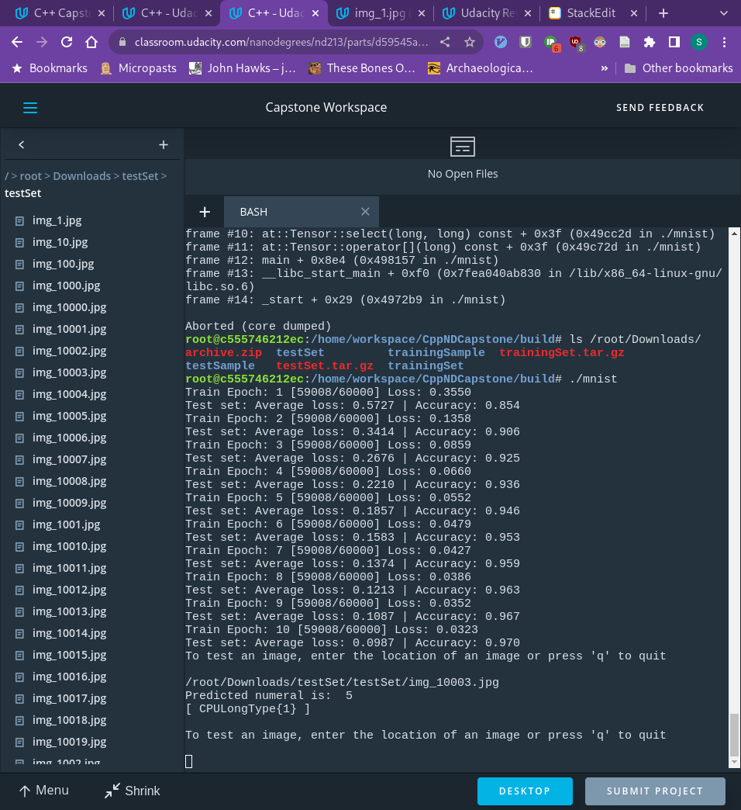

ppNDCapstone

Capstone for C++ Nanodegree

# Steps to Build

### Step 1: Install dependencies for your distro
#### Arch
`sudo pacman -S python-pytorch`
 `sudo pacman -S opencv`
#### Udacity Workspace
##### Torch Lib
`wget https://download.pytorch.org/libtorch/nightly/cpu/libtorch-shared-with-deps-latest.zip`
`unzip libtorch-shared-with-deps-latest.zip`
If this does not work, try the installation [instructions](https://pytorch.org/cppdocs/installing.html)
##### OpenCV
`wget -O opencv.zip https://github.com/opencv/opencv/archive/4.x.zip`
`unzip opencv.zip`
`mkdir -p build && cd build`
`cmake ../opencv-4.x`
`cmake --build .`

Please see the installation [page](https://docs.opencv.org/4.x/d7/d9f/tutorial_linux_install.html).
[Here](https://www.tutorialspoint.com/how-to-install-opencv-for-cplusplus-in-windows) is a tutorial for Windows.
And finally, [here](https://www.geeksforgeeks.org/how-to-install-opencv-for-c-on-macos/) is for Mac.

### Step 2: Build
Disclaimer: To simplify setting up the correct file structure with the appropriate downloaded data the `download_data.py` script and the coordinating block of download code in the CMake file were used from the [PyTorch github](https://github.com/pytorch/examples/tree/main/cpp/mnist).  This is to assist in the ease of grading, not because it is necessary for the program to work; the [MNIST dataset](http://yann.lecun.com/exdb/mnist/) can be downloaded manually into a data directory inside the build directory.
```
mkdir build
cd build
mkdir data
cmake -DCMAKE_PREFIX_PATH=/path/to/libtorch .. (if in Arch, cmake .. is all you need)
make
```

### Step 3: Train the model
`./mnist`

### Step 4: Test
You may download the dataset in .jpg format [here](https://www.kaggle.com/datasets/scolianni/mnistasjpg) and unzip the file in any directory you choose.
After the model trains, it will ask for a path directory to any of the images in that dataset and return to you the numeral that is written in the image.  You may continue to enter images or submit 'q' to exit the program.

# LeNet

Because my interest in C++ stems from my interests in machine learning and artificial intelligence, I opted to do my capstone project in this area. I recreated  [LeNet 5](http://yann.lecun.com/exdb/publis/pdf/lecun-01a.pdf). This was chosen because it is now a simple enough neural net to be understood and recreated with my still rudimentary understanding of C++, despite being a groundbreaking method 20 years ago.

## [](https://github.com/sfmajors373/CppNDCapstone/blob/main/README.md#file-structure)File Structure
```
|-CMakeLists.txt 
|-dataloaders.tpp 
|-mnist.cpp 
|-net.h 
|-net.cpp 
|-README.md 
|---build 
	|---data 
		|--t10k-images-idx1-ubyte 
		|--t10k-labels-idx1-ubyte 
		|--t10k-images-idx3-ubyte 
		|--t10k-labels-idx3-ubyte
```

## [](https://github.com/sfmajors373/CppNDCapstone/blob/main/README.md#class-structure)Class Structure

As I chose to use libtorch library in this project, I opted to keep in line with its coding style. Libtorch uses structs and templates more than classes so I have also use structs instead of classes. I have separated the net definition into its own file so there is a  `net.h`  and a  `net.cpp`. I have also placed the dataloaders in their own file as  `dataloaders.tpp`.

## [](https://github.com/sfmajors373/CppNDCapstone/blob/main/README.md#expected-output)Expected Output
During training the loss should approach zero as the accuracy approaches 1 (neither actually reaching zero or one).  The program will then ask for a path to a test jpg as input and will return the predicted integer written in the image. (Downloading the above provided link in the Udacity workspace, placed the images in `/root/Downloads/testSet/testSet/`)




## [](https://github.com/sfmajors373/CppNDCapstone/blob/main/README.md#rubric)Rubric

For the completion of the capstone project, I must satisfy four mandatory criteria as well as an additional five of my choosing. The  [rubric](https://github.com/sfmajors373/CppNDCapstone/blob/main/UdacityCapstoneRubric.pdf)  can be found in the repository as well. Below I will discuss each of the criteria.

### [](https://github.com/sfmajors373/CppNDCapstone/blob/main/README.md#a-readme-with-instructions-is-included-with-project)A README with instructions is included with project

-   README is included with the project and has instructions for building/running the project
-   If any additional libraries are needed to run the project, these are indicated with cross-platform installation instructions.
-   Markdown or pdf: Markdown is chosen

### [](https://github.com/sfmajors373/CppNDCapstone/blob/main/README.md#the-readme-indicates-which-project-is-chosen)The README indicates which project is chosen

-   The README describes the project you have built.
-   The README also indicates the file and class structure, along with the expected behavior or output of the program

### [](https://github.com/sfmajors373/CppNDCapstone/blob/main/README.md#the-readme-includes-information-about-each-rubric-point-addressed)The README includes information about each rubric point addressed

-   The README indicates which rubric points are addressed. The README also indicates where in the code (i.e. files and line numbers) that the rubric points are addressed.

### [](https://github.com/sfmajors373/CppNDCapstone/blob/main/README.md#the-submission-must-compile-and-run)The submission must compile and run

-   The project code must compile and run without errors
-   Code must compile on any reviewer platform

### [](https://github.com/sfmajors373/CppNDCapstone/blob/main/README.md#the-project-reads-data-from-a-file-and-process-the-data)The project reads data from a file and process the data

-   The project reads data from an external file or writes data to a file as part of the necessary operation of the program  [mnist.cpp, line 88](https://github.com/sfmajors373/CppNDCapstone/blob/ac77cd613b7c9999ab1e048604d5997769be2e76/mnist.cpp#L88)

### [](https://github.com/sfmajors373/CppNDCapstone/blob/main/README.md#the-project-accepts-user-input-and-processes-the-input)The project accepts user input and processes the input

-   The porject accepts input from a user as part of the necessary operation of the program  [mnist.cpp, line 79](https://github.com/sfmajors373/CppNDCapstone/blob/ac77cd613b7c9999ab1e048604d5997769be2e76/mnist.cpp#L79)

### [](https://github.com/sfmajors373/CppNDCapstone/blob/main/README.md#the-project-demonstrates-an-understanding-of-c-functions-and-control-structures)The project demonstrates an understanding of C++ functions and control structures

-   A variety of control structures are used in the project  [while loop: mnist.cpp, line 74](https://github.com/sfmajors373/CppNDCapstone/blob/ac77cd613b7c9999ab1e048604d5997769be2e76/mnist.cpp#L74),  [for loop: mnist.cpp, line 100](https://github.com/sfmajors373/CppNDCapstone/blob/ac77cd613b7c9999ab1e048604d5997769be2e76/mnist.cpp#L100)
-   the project is clearly organized into functions

### [](https://github.com/sfmajors373/CppNDCapstone/blob/main/README.md#templates-generalize-functions-in-the-project)Templates generalize functions in the project

-   One function is declared with a template that allows it to accept a generic parameter  [train: dataloaders.tpp, line 11](https://github.com/sfmajors373/CppNDCapstone/blob/ac77cd613b7c9999ab1e048604d5997769be2e76/dataloaders.tpp#L11),  [test: dataloaders.tpp, line 46](https://github.com/sfmajors373/CppNDCapstone/blob/ac77cd613b7c9999ab1e048604d5997769be2e76/dataloaders.tpp#L46)

### [](https://github.com/sfmajors373/CppNDCapstone/blob/main/README.md#the-project-uses-move-semantics-to-move-data-instead-of-copying-it-where-possible)The project uses move semantics to move data, instead of copying it, where possible

-   For classes with move constructors, the project returns objects of that class by value, and relies on the move constructor, instead of copying the object  [mnist.cpp, line 52](https://github.com/sfmajors373/CppNDCapstone/blob/ac77cd613b7c9999ab1e048604d5997769be2e76/mnist.cpp#L52),  [mnist.cpp, line 62](https://github.com/sfmajors373/CppNDCapstone/blob/ac77cd613b7c9999ab1e048604d5997769be2e76/mnist.cpp#L62)
